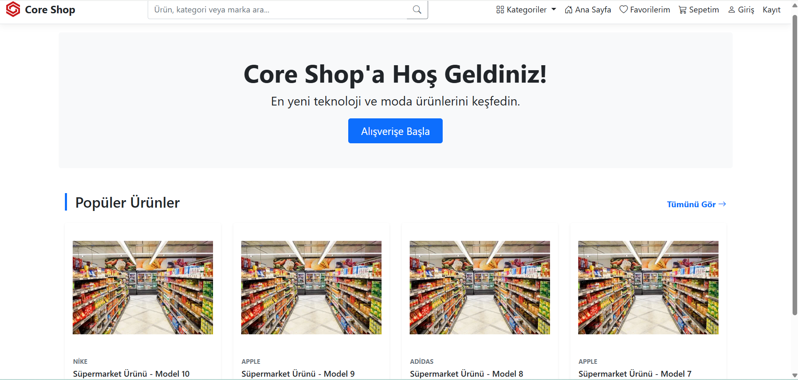
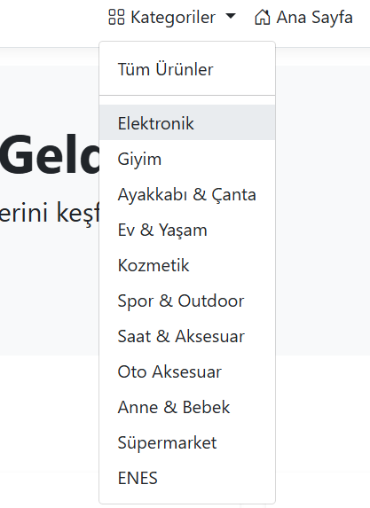
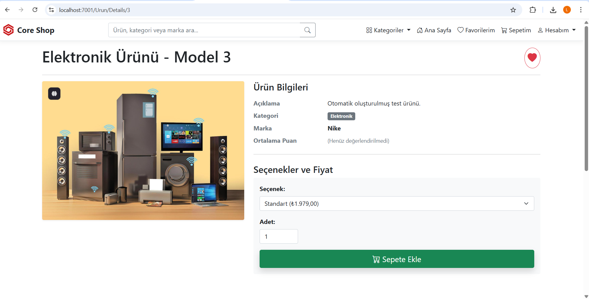

# 🛍️ Core Shop - E-Ticaret Platformu

**Core Shop**, ASP.NET Core MVC teknolojisi kullanılarak geliştirilmiş,  
**N-Katmanlı Mimari (N-Layer Architecture)** prensiplerine uygun, modern ve ölçeklenebilir bir e-ticaret uygulamasıdır.

Kullanıcıların kategori bazlı vitrinlerde gezinebildiği, detaylı filtreleme yapabildiği, sepete ürün ekleyip sipariş verebildiği uçtan uca bir alışveriş deneyimi sunar.  
Proje, **Clean Code** ve **SOLID** prensipleri gözetilerek tasarlanmıştır.

---

## 📸 Proje Görselleri

### 1️⃣ Ana Sayfa ve Karşılama Ekranı
Kullanıcıyı karşılayan Hero alanı ve popüler ürünlerin listelendiği ana giriş sayfası.  

### 2️⃣ Kategori Vitrini (Showcase Modu)
Kullanıcı **“Tümünü Gör”** dediğinde açılan, ürünlerin kategorilere göre şeritler halinde ayrıldığı (Netflix tarzı) vitrin görünümü.  

### 3️⃣ Ürün Detay ve Sepet İşlemleri
Ürün açıklamaları, stok bilgisi ve fiyat seçeneklerinin yer aldığı detay sayfası.  

> 📌 Görseller `README.md` ile aynı dizine eklenmelidir.

---

## 🌟 Öne Çıkan Özellikler

### 👤 Kullanıcı Arayüzü (UI)
- Akıllı vitrin sistemi (kategori bazlı ürün sunumu)
- Dinamik arama ve filtreleme
- Session bazlı sepet yönetimi
- ASP.NET Core Identity ile üyelik sistemi
- Stok kontrolü ve “Tükendi” uyarıları

### 🛠️ Yönetim Paneli (Admin)
- Ürün ve kategori yönetimi
- Ürün görsel yönetimi
- Marka tanımlamaları
- Yönetici yetkilendirme altyapısı

---

## 🏗️ Mimari Yapı

Proje sürdürülebilirlik ve genişletilebilirlik amacıyla **N-Katmanlı Mimari** kullanılarak geliştirilmiştir.

